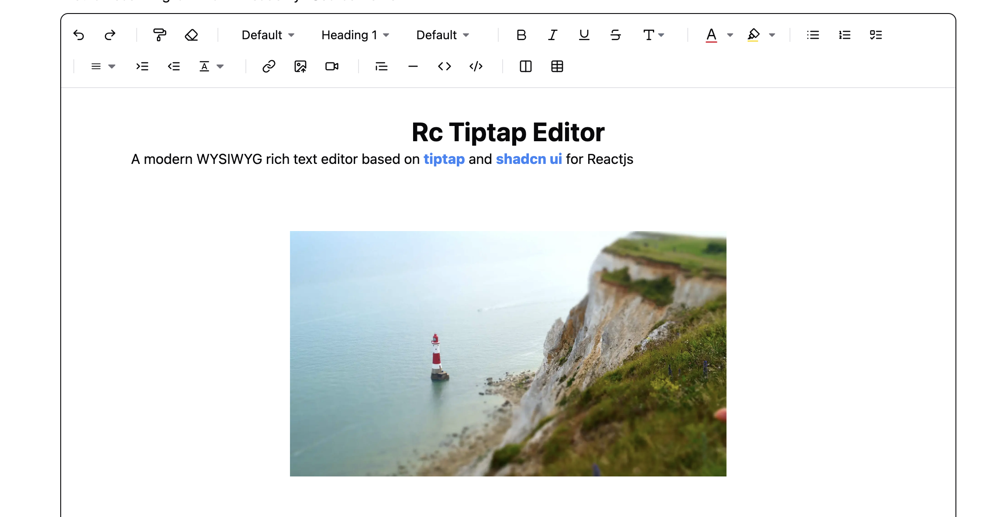
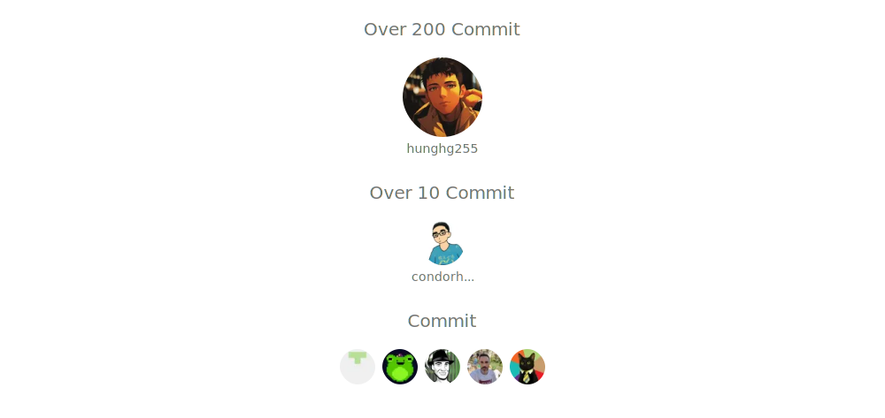

<p align="center">
<a href="https://www.npmjs.com/package/reactjs-tiptap-editor" target="_blank" rel="noopener noreferrer">
</a>
</p>

<p align="center">
 A modern WYSIWYG rich-text editor base on Tiptap uses Shadcn components.
</p>

<p align="center">
  <a href="https://www.npmjs.com/package/reactjs-tiptap-editor" target="_blank" rel="noopener noreferrer"></a>
  <a href="https://www.npmjs.com/package/reactjs-tiptap-editor" target="_blank" rel="noopener noreferrer"></a>
  <a href="https://bundlephobia.com/result?p=reactjs-tiptap-editor" target="_blank" rel="noopener noreferrer"></a>
  <a href="https://github.com/hunghg255/reactjs-tiptap-editor/graphs/contributors" target="_blank" rel="noopener noreferrer"></a>
  <a href="https://github.com/hunghg255/reactjs-tiptap-editor/blob/main/LICENSE" target="_blank" rel="noopener noreferrer"></a>
  <a href="https://webuild.community" target="_blank" rel="noopener noreferrer"></a>
  <a href="https://webuild.community" target="_blank" rel="noopener noreferrer"></a>
</p>



## Demo

[Demo](https://reactjs-tiptap-editor-playground.vercel.app/)

## Documentation

[Documentation](https://reactjs-tiptap-editor.vercel.app/)

## Deep wiki

[Deep Wiki](https://deepwiki.com/hunghg255/reactjs-tiptap-editor)

## Run Locally

Clone the project

```bash
git clone https://github.com/hunghg255/reactjs-tiptap-editor.git
```

Go to the project directory

```bash
cd reactjs-tiptap-editor
```

Install dependencies

```bash
pnpm install
```

Start the Demo server

```bash
npm run build:lib:dev
npm run playground
```

## All Contributors

Thanks to the following friends for their contributions to project:



## Star History


## Related

Here are some related projects

[Tiptap](https://tiptap.dev)

[Shadcn](https://ui.shadcn.com/)

[echo-editor](https://github.com/Seedsa/echo-editor)

## License

[MIT](./LICENSE)
