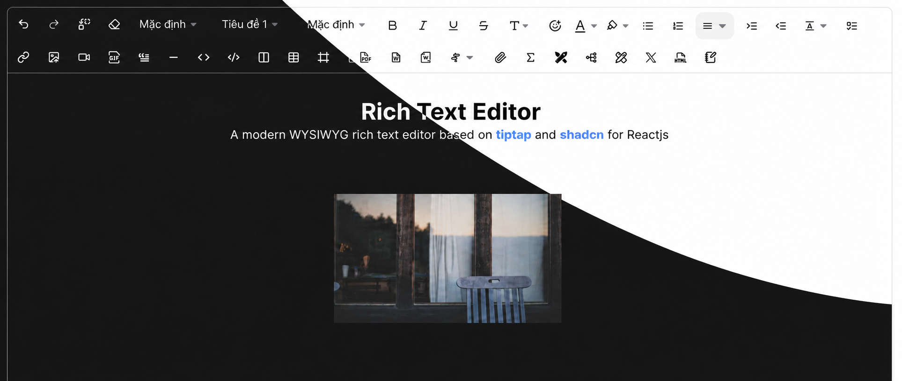
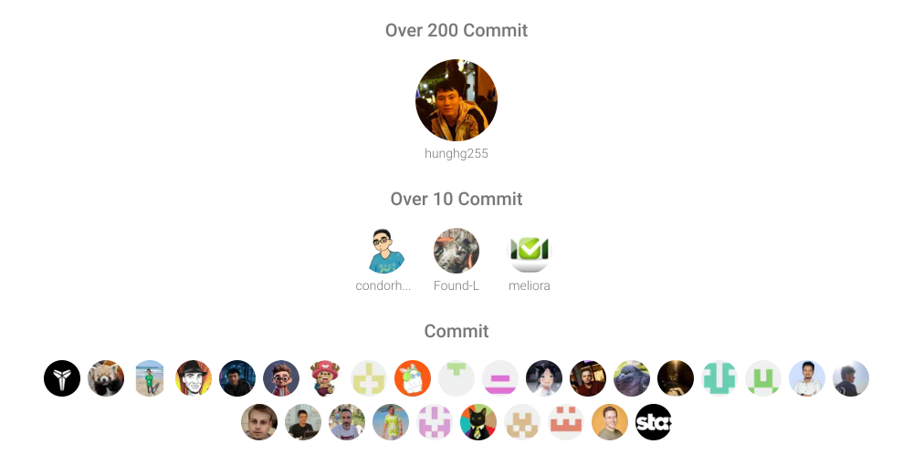

<p align="center">
<a href="https://www.npmjs.com/package/reactjs-tiptap-editor" target="_blank" rel="noopener noreferrer">
</a>
</p>

<p align="center">
 A modern WYSIWYG rich-text editor base on Tiptap uses Shadcn components.
</p>

<p align="center">
  <a href="https://www.npmjs.com/package/reactjs-tiptap-editor" target="_blank" rel="noopener noreferrer"></a>
  <a href="https://www.npmjs.com/package/reactjs-tiptap-editor" target="_blank" rel="noopener noreferrer"></a>
  <a href="https://bundlephobia.com/result?p=reactjs-tiptap-editor" target="_blank" rel="noopener noreferrer"></a>
  <a href="https://github.com/hunghg255/reactjs-tiptap-editor/graphs/contributors" target="_blank" rel="noopener noreferrer"></a>
  <a href="https://github.com/hunghg255/reactjs-tiptap-editor/blob/main/LICENSE" target="_blank" rel="noopener noreferrer"></a>
</p>



## Demo

[Demo](https://reactjs-tiptap-editor-playground.vercel.app/)

## Documentation

[Documentation](https://reactjs-tiptap-editor.vercel.app/)

For the current source API, see [Getting Started](./docs/guide/getting-started.md), [individual bubble imports](./docs/guide/bubble-menu.md), and [selective locale loading](./docs/guide/internationalization.md). Bundle measurements and before/after comparisons are in the [optimization report](./reports/bundle-size/REPORT-ROUND2.md).

## Deep wiki

[Deep Wiki](https://deepwiki.com/hunghg255/reactjs-tiptap-editor)

## Run Locally

Clone the project

```bash
git clone https://github.com/hunghg255/reactjs-tiptap-editor.git
```

Go to the project directory

```bash
cd reactjs-tiptap-editor
```

Install dependencies

```bash
pnpm install
```

Start the Demo server

```bash
npm run build:lib:dev
npm run playground
```

## All Contributors

Thanks to the following friends for their contributions to project:



## Star History


## Related

Here are some related projects

[Tiptap](https://tiptap.dev)

[Shadcn](https://ui.shadcn.com/)

## License

[MIT](./LICENSE)

## Sponsors

<p align="center">
  <a href="https://cdn.jsdelivr.net/gh/hunghg255/sponsors/sponsors.svg">
    
  </a>
</p>


## 🌐 Web Resources & Aesthetic Symbols Index
- [SYM 1D448](https://sleek-line-symbols-51.pages.dev/symbol/sym-1d448/)
- [STARS](https://matrix-hacker-text-52.pages.dev/vi/stars/)
- [SYM 1D48C](https://clean-aesthetic-fonts-33.pages.dev/symbol/sym-1d48c/)
- [HOLLOW STAR](https://chibi-kaomoji-vault-58.pages.dev/symbol/hollow-star/)
- [RIGHT POINTING DOUBLE ANGLE QUOTATION](https://sleek-line-symbols-51.pages.dev/symbol/right-pointing-double-angle-quotation/)
- [SYM 26DC](https://gothic-bio-fonts-69.pages.dev/symbol/sym-26dc/)
- [SYM 1D497](https://clean-aesthetic-fonts-73.pages.dev/symbol/sym-1d497/)
- [SYM 268E](https://zen-unicode-symbols-89.pages.dev/symbol/sym-268e/)
- [SWIMMING FISH RIGHT](https://soft-pink-fonts-41.pages.dev/symbol/swimming-fish-right/)
- [SYM 1F61C](https://sleek-line-symbols-51.pages.dev/symbol/sym-1f61c/)
- [SYM 26FD](https://alchemist-symbol-hub-29.pages.dev/symbol/sym-26fd/)
- [SYM 1F60B](https://sleek-line-symbols-51.pages.dev/symbol/sym-1f60b/)
- [SYM 2624](https://ribbon-heart-fonts-86.pages.dev/symbol/sym-2624/)
- [WHITE HEART](https://clean-aesthetic-fonts-33.pages.dev/symbol/white-heart/)
- [BRACKETS](https://sleek-bio-symbols-40.pages.dev/vi/brackets/)
- [SYM 268B](https://kawaii-kaomoji-hub-96.pages.dev/symbol/sym-268b/)
- [SYM 1F47D](https://scholarly-cross-symbols-35.pages.dev/symbol/sym-1f47d/)
- [SYM 26B8](https://daintystar-font-studio-48.pages.dev/symbol/sym-26b8/)
- [SYM 1F626](https://chibi-bunny-symbols-82.pages.dev/symbol/sym-1f626/)
- [SYM 1F649](https://cyber-clan-tags-75.pages.dev/symbol/sym-1f649/)
- [SYM 1D470](https://kawaii-kaomoji-hub-96.pages.dev/symbol/sym-1d470/)
- [SYM 1D449](https://coquette-aesthetic-symbols-63.pages.dev/symbol/sym-1d449/)
- [SYM 1D459](https://cyber-clan-tags-75.pages.dev/symbol/sym-1d459/)
- [LATIN CROSS FAITH](https://mecha-gamer-fonts-53.pages.dev/symbol/latin-cross-faith/)
- [SYM 26D3](https://coquette-aesthetic-symbols-63.pages.dev/symbol/sym-26d3/)
- [SYM 2645](https://zen-unicode-hub-94.pages.dev/symbol/sym-2645/)
- [SYM 1FAE2](https://zen-spacing-text-68.pages.dev/symbol/sym-1fae2/)
- [SYM 1D487](https://raven-gothic-kaomoji-25.pages.dev/symbol/sym-1d487/)
- [SKULL AND CROSSBONES](https://raven-gothic-kaomoji-25.pages.dev/symbol/skull-and-crossbones/)
- [INSTAGRAM BIO](https://mecha-gamer-fonts-53.pages.dev/vi/instagram-bio/)
- [SYM 1D445](https://coquette-aesthetic-symbols-63.pages.dev/symbol/sym-1d445/)
- [LACE BOW SYMBOLS 18.PAGES.DEV](https://lace-bow-symbols-18.pages.dev/)
- [ROYAL GOLD CROWN](https://gothic-bio-fonts-81.pages.dev/symbol/royal-gold-crown/)
- [SYM 1F600](https://pastel-manga-symbols-57.pages.dev/symbol/sym-1f600/)
- [TRENDING](https://glitch-matrix-fonts-28.pages.dev/ja/trending/)
- [SYM 1D433](https://occult-rune-symbols-64.pages.dev/symbol/sym-1d433/)
- [SYM 1D48A](https://zen-spacing-text-68.pages.dev/symbol/sym-1d48a/)
- [SYM 2611](https://zen-spacing-text-68.pages.dev/symbol/sym-2611/)
- [ES](https://modern-bullet-symbols-45.pages.dev/es/)
- [SYM 2686](https://zen-unicode-hub-94.pages.dev/symbol/sym-2686/)
- [SYM 1D44C](https://daintystar-font-studio-48.pages.dev/symbol/sym-1d44c/)
- [SYM 1F63A](https://sleek-line-symbols-51.pages.dev/symbol/sym-1f63a/)
- [SYM 1D484](https://cyber-clan-tags-23.pages.dev/symbol/sym-1d484/)
- [DISCORD STATUS](https://chibi-emoticon-lab-65.pages.dev/pt/discord-status/)
- [SYM 2764 FE0F](https://sleek-line-symbols-51.pages.dev/symbol/sym-2764-fe0f/)
- [SYM 1FA77](https://sleek-line-symbols-51.pages.dev/symbol/sym-1fa77/)
- [SYM 26E2](https://gothic-bio-fonts-81.pages.dev/symbol/sym-26e2/)
- [SYM 2732](https://chibi-kaomoji-vault-58.pages.dev/symbol/sym-2732/)
- [SYM 2728](https://sleek-line-symbols-51.pages.dev/symbol/sym-2728/)
- [ES](https://chibi-kaomoji-vault-58.pages.dev/es/)
- [SYM 2744](https://zen-spacing-text-68.pages.dev/symbol/sym-2744/)
- [SYM 2741](https://zen-unicode-hub-94.pages.dev/symbol/sym-2741/)
- [SYM 2744](https://anime-sparkle-text-22.pages.dev/symbol/sym-2744/)
- [BEAMED SIXTEENTH MUSICAL NOTES](https://gothic-bio-fonts-81.pages.dev/symbol/beamed-sixteenth-musical-notes/)
- [SYM 1F49B](https://sleek-line-symbols-51.pages.dev/symbol/sym-1f49b/)
- [SHADOWED WHITE STAR](https://mecha-blade-symbols-46.pages.dev/symbol/shadowed-white-star/)
- [SYM 1D492](https://zen-unicode-hub-94.pages.dev/symbol/sym-1d492/)
- [SYM 1F619](https://pastel-chibi-emotes-23.pages.dev/symbol/sym-1f619/)
- [SYM 2642](https://daintystar-font-studio-48.pages.dev/symbol/sym-2642/)
- [SYM 26E5](https://coquette-aesthetic-symbols-63.pages.dev/symbol/sym-26e5/)
- [SYM 1D41F](https://occult-rune-symbols-64.pages.dev/symbol/sym-1d41f/)
- [SYM 2748](https://zen-unicode-hub-94.pages.dev/symbol/sym-2748/)
- [SYM 1D402](https://clean-aesthetic-fonts-73.pages.dev/symbol/sym-1d402/)
- [SYM 1F644](https://gothic-bio-fonts-14.pages.dev/symbol/sym-1f644/)
- [SYM 262F](https://zen-unicode-hub-94.pages.dev/symbol/sym-262f/)
- [SYM 1D402](https://moe-soft-emoticons-41.pages.dev/symbol/sym-1d402/)
- [SYM 2658](https://ribbon-heart-fonts-86.pages.dev/symbol/sym-2658/)
- [HEARTS](https://zen-spacing-text-68.pages.dev/hearts/)
- [SYM 1F619](https://chibi-kaomoji-vault-58.pages.dev/symbol/sym-1f619/)
- [SYM 2685](https://occult-rune-symbols-64.pages.dev/symbol/sym-2685/)
- [SYM 1D464](https://anime-sparkle-text-73.pages.dev/symbol/sym-1d464/)
- [SYM 2639 FE0F](https://matrix-hacker-text-52.pages.dev/symbol/sym-2639-fe0f/)
- [SYM 26C3](https://daintystar-font-studio-48.pages.dev/symbol/sym-26c3/)
- [SYM 1F61C](https://techno-hacker-text-43.pages.dev/symbol/sym-1f61c/)
- [SYM 26EA](https://zen-spacing-text-68.pages.dev/symbol/sym-26ea/)
- [SYM 26CE](https://moe-soft-emoticons-41.pages.dev/symbol/sym-26ce/)
- [GAMING WEAPONS](https://chibi-kaomoji-vault-58.pages.dev/pt/gaming-weapons/)
- [LEFT HEAVY BRACKET BOX](https://zen-spacing-text-68.pages.dev/symbol/left-heavy-bracket-box/)
- [SYM 1F637](https://sleek-line-symbols-51.pages.dev/symbol/sym-1f637/)
- [SYM 1F624](https://chibi-bunny-symbols-82.pages.dev/symbol/sym-1f624/)
- [SYM 2613](https://gothic-bio-fonts-14.pages.dev/symbol/sym-2613/)
- [SYM 1F63C](https://sleek-line-symbols-51.pages.dev/symbol/sym-1f63c/)
- [SYM 1F497](https://sleek-line-symbols-51.pages.dev/symbol/sym-1f497/)
- [STARRY LOVE AURA](https://raven-gothic-kaomoji-25.pages.dev/symbol/starry-love-aura/)
- [SYM 1F60B](https://mecha-synth-kaomoji-92.pages.dev/symbol/sym-1f60b/)
- [SYM 1D441](https://coquette-aesthetic-symbols-63.pages.dev/symbol/sym-1d441/)
- [SYM 26E6](https://occult-rune-symbols-64.pages.dev/symbol/sym-26e6/)
- [LEFT BLACK LENTICULAR BRACKET](https://sleek-line-symbols-51.pages.dev/symbol/left-black-lenticular-bracket/)
- [SYM 1F606](https://zen-unicode-hub-94.pages.dev/symbol/sym-1f606/)
- [SYM 260C](https://anime-sparkle-text-73.pages.dev/symbol/sym-260c/)
- [SYM 2666](https://kawaii-kaomoji-hub-96.pages.dev/symbol/sym-2666/)
- [SYM 273E](https://cyber-clan-tags-69.pages.dev/symbol/sym-273e/)
- [OPEN CENTRE STAR](https://chibi-bunny-symbols-82.pages.dev/symbol/open-centre-star/)
- [SYM 2657](https://techwear-bio-symbols-45.pages.dev/symbol/sym-2657/)
- [SYM 1F972](https://anime-sparkle-text-22.pages.dev/symbol/sym-1f972/)
- [SYM 1F61E](https://coquette-aesthetic-symbols-63.pages.dev/symbol/sym-1f61e/)
- [SYM 1D481](https://matrix-hacker-text-52.pages.dev/symbol/sym-1d481/)
- [SYM 26A2](https://gothic-bio-fonts-14.pages.dev/symbol/sym-26a2/)
- [SYM 1F63B](https://sleek-line-symbols-51.pages.dev/symbol/sym-1f63b/)
- [FLOWER GIRL SMILE KAOMOJI](https://vintage-scholar-text-15.pages.dev/symbol/flower-girl-smile-kaomoji/)
- [SYM 1F9E1](https://vintage-scholar-text-15.pages.dev/symbol/sym-1f9e1/)
- [SAGITTARIUS ZODIAC ARCHER](https://mecha-gamer-fonts-53.pages.dev/symbol/sagittarius-zodiac-archer/)
- [TRENDING](https://zen-spacing-text-68.pages.dev/es/trending/)
- [RU](https://vintage-scholar-text-15.pages.dev/ru/)
- [SYM 2625](https://coquette-aesthetic-symbols-14.pages.dev/symbol/sym-2625/)
- [SYM 1F624](https://mecha-gamer-fonts-53.pages.dev/symbol/sym-1f624/)
- [SYM 26C3](https://dolly-kaomoji-text-94.pages.dev/symbol/sym-26c3/)
- [SYM 26E9](https://daintystar-font-studio-48.pages.dev/symbol/sym-26e9/)
- [SYM 1D407](https://matrix-hacker-text-52.pages.dev/symbol/sym-1d407/)
- [SYM 1D498](https://sleek-line-symbols-51.pages.dev/symbol/sym-1d498/)
- [SYM 1D40C](https://sleek-dot-symbols-31.pages.dev/symbol/sym-1d40c/)
- [SYM 1F92B](https://mecha-gamer-fonts-53.pages.dev/symbol/sym-1f92b/)
- [SPRING TULIP BLOSSOM](https://sleek-bio-symbols-40.pages.dev/symbol/spring-tulip-blossom/)
- [SYM 1D448](https://nordic-minimal-fonts-67.pages.dev/symbol/sym-1d448/)
- [SYM 1F913](https://coquette-aesthetic-symbols-14.pages.dev/symbol/sym-1f913/)
- [SYM 26F9](https://matrix-hacker-text-52.pages.dev/symbol/sym-26f9/)
- [RIGHT WING CLAN FLARE](https://sleek-bio-symbols-40.pages.dev/symbol/right-wing-clan-flare/)
- [BORDERS DIVIDERS](https://anime-sparkle-text-73.pages.dev/ru/borders-dividers/)
- [SYM 1F972](https://mecha-gamer-fonts-53.pages.dev/symbol/sym-1f972/)
- [DISCORD STATUS](https://cyber-clan-tags-75.pages.dev/ru/discord-status/)
- [GREEK PSI TRIDENT](https://techno-hacker-text-43.pages.dev/symbol/greek-psi-trident/)
- [SYM 26A7](https://matrix-hacker-text-52.pages.dev/symbol/sym-26a7/)
- [SYM 1F601](https://neon-hacker-text-25.pages.dev/symbol/sym-1f601/)
- [SYM 2732](https://mecha-gamer-fonts-53.pages.dev/symbol/sym-2732/)
- [SYM 26B7](https://minimal-star-symbols-25.pages.dev/symbol/sym-26b7/)
- [SYM 26D5](https://chibi-kaomoji-vault-58.pages.dev/symbol/sym-26d5/)
- [SYM 1D46B](https://sleek-line-symbols-51.pages.dev/symbol/sym-1d46b/)
- [SYM 1D45C](https://nordic-minimal-fonts-67.pages.dev/symbol/sym-1d45c/)
- [SYM 26F2](https://vintage-scholar-text-15.pages.dev/symbol/sym-26f2/)
- [SYM 1D448](https://chibi-kaomoji-vault-58.pages.dev/symbol/sym-1d448/)
